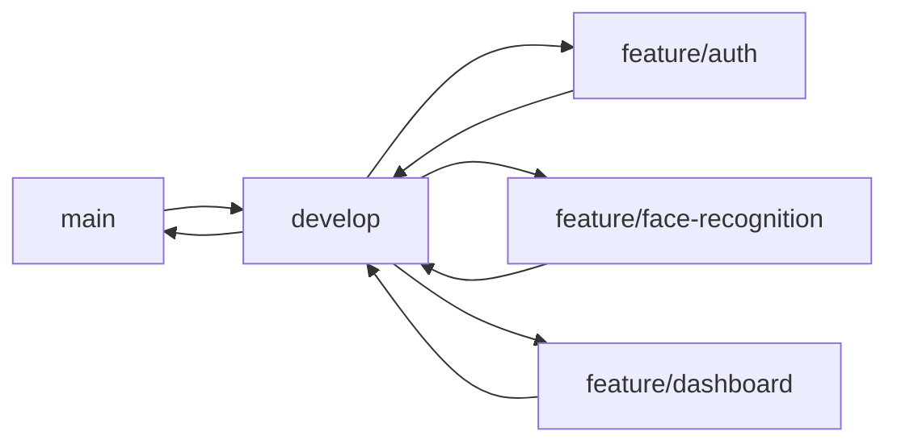

# Guía de Colaboración - Sistema de Asistencias con Reconocimiento Facial

## 🎯 Estrategia de Colaboración para 3 Personas

### Opción Recomendada: Git + GitHub/GitLab

**¿Por qué Git?**
- Control de versiones profesional
- Trabajo simultáneo sin conflictos
- Historial completo de cambios
- Integración con herramientas modernas
- Gratuito y estándar de la industria

---

## 📋 División de Trabajo Recomendada

### **Persona 1 (Tech Lead / Full-Stack)** - Tú
**Responsabilidades:**
- Arquitectura general del sistema
- Configuración inicial del proyecto
- Sistema de autenticación
- Integración frontend-backend
- Deployment y configuración de servidores

**Módulos Asignados:**
- `backend/app/config/` - Configuración del sistema
- `backend/app/api/auth.py` - Autenticación
- `backend/app/core/` - Utilidades core
- Docker y deployment
- Documentación general

### **Persona 2 (Backend Developer)**
**Responsabilidades:**
- Motor de reconocimiento facial
- APIs de gestión de datos
- Base de datos y modelos
- Sistema offline/sync

**Módulos Asignados:**
- `backend/app/services/face_service.py` - Reconocimiento facial
- `backend/app/api/face_recognition.py` - API facial
- `backend/app/api/attendance.py` - API asistencias
- `backend/app/services/offline_sync_service.py` - Offline
- `backend/app/models/` - Modelos de base de datos
- Testing del backend

### **Persona 3 (Frontend Developer)**
**Responsabilidades:**
- Interfaces de usuario
- Dashboards y reportes
- Módulo de cámara
- Diseño y UX

**Módulos Asignados:**
- `frontend/src/components/` - Todos los componentes
- `frontend/src/pages/` - Todas las páginas
- `frontend/src/services/` - Servicios de API
- `frontend/src/hooks/` - Custom hooks
- CSS y diseño responsive

---

## 🚀 Setup Inicial con Git

### Paso 1: Crear Repositorio en GitHub

```bash
# 1. Crear cuenta en GitHub (si no tienen)
# Ir a: https://github.com/signup

# 2. En GitHub, crear nuevo repositorio:
# - Click "New repository"
# - Nombre: attendance-face-recognition
# - Descripción: Sistema de Control de Asistencias con Reconocimiento Facial
# - Visibilidad: Private (para proyecto universitario)
# - ✅ Add README
# - ✅ Add .gitignore → Python

# 3. Clonar el repositorio en tu computadora
git clone https://github.com/tu-usuario/attendance-face-recognition.git
cd attendance-face-recognition
```

### Paso 2: Configurar .gitignore

Crear/actualizar `.gitignore` en la raíz:

```gitignore
# Python
__pycache__/
*.py[cod]
*$py.class
*.so
.Python
env/
venv/
ENV/
.venv
*.egg-info/
dist/
build/

# Node / React
node_modules/
npm-debug.log*
yarn-debug.log*
yarn-error.log*
dist/
build/

# Environment
.env
.env.local
.env.production

# IDEs
.vscode/
.idea/
*.swp
*.swo

# Database
*.db
*.sqlite3

# Face Recognition Data (IMPORTANTE)
face_storage/
*.pkl
encodings/

# OS
.DS_Store
Thumbs.db

# Logs
*.log
logs/

# Secrets (CRÍTICO)
config/secrets.yml
*.pem
*.key
```

### Paso 3: Invitar Colaboradores

**En GitHub:**
1. Ir a tu repositorio
2. Click en `Settings` → `Collaborators`
3. Click en `Add people`
4. Agregar emails o usernames de tus 2 compañeros
5. Ellos recibirán invitación por email

**Permisos:** Dar `Write` access a ambos

---

## 🔄 Workflow de Git (Estrategia de Ramas)

### Ramas Principales



- **`main`**: Código estable y funcional
- **`develop`**: Desarrollo activo
- **`feature/nombre`**: Ramas individuales por característica

### Comandos Esenciales

#### Setup Inicial (Hacerlo UNA vez)

```bash
# Clonar el repo
git clone https://github.com/tu-usuario/attendance-face-recognition.git
cd attendance-face-recognition

# Crear rama develop
git checkout -b develop
git push -u origin develop
```

#### Workflow Diario

**1. Antes de empezar a trabajar:**
```bash
# SIEMPRE actualizar primero
git checkout develop
git pull origin develop
```

**2. Crear una nueva feature:**
```bash
# Crear rama para tu feature
git checkout -b feature/nombre-descriptivo

# Ejemplos:
# git checkout -b feature/authentication
# git checkout -b feature/face-detection
# git checkout -b feature/admin-dashboard
```

**3. Trabajar y hacer commits:**
```bash
# Ver qué archivos cambiaron
git status

# Agregar archivos
git add .
# O específicos: git add backend/app/api/auth.py

# Commit con mensaje descriptivo
git commit -m "feat: implementar login de usuarios"
```

**Tipos de commits:**
- `feat:` nueva funcionalidad
- `fix:` corrección de bug
- `docs:` documentación
- `style:` formato de código
- `refactor:` refactorización
- `test:` agregar tests

**4. Subir cambios:**
```bash
# Push a tu rama
git push origin feature/nombre-descriptivo
```

**5. Crear Pull Request:**
- Ir a GitHub
- Verás botón "Compare & pull request"
- Base: `develop` ← Compare: `feature/tu-rama`
- Escribir descripción clara
- Solicitar review de compañeros
- Esperar aprobación y merge

**6. Después del merge:**
```bash
# Actualizar develop local
git checkout develop
git pull origin develop

# Eliminar rama local (opcional)
git branch -d feature/nombre-descriptivo
```

### Resolver Conflictos

```bash
# 1. Actualizar develop
git checkout develop
git pull origin develop

# 2. Ir a tu rama
git checkout feature/tu-rama

# 3. Merge develop en tu rama
git merge develop

# 4. Si hay conflictos, Git te avisará
# Abre los archivos y resuelve manualmente
# Busca las marcas <<<<<<< y >>>>>>>

# 5. Después de resolver:
git add .
git commit -m "fix: resolver conflictos con develop"
git push origin feature/tu-rama
```

---

## 📞 Herramientas de Comunicación

### Recomendadas

**1. Discord / Slack** (Comunicación diaria)
- Canal `#general` - Anuncios y chat
- Canal `#backend` - Temas de backend
- Canal `#frontend` - Temas de frontend
- Canal `#bugs` - Reportar problemas
- Canal `#recursos` - Links y documentación

**2. GitHub Issues** (Gestión de tareas)
```markdown
Ejemplo de Issue:

Título: Implementar Sistema de Autenticación JWT

## Descripción
Crear el sistema de autenticación usando JWT para los 3 roles.

## Tareas
- [ ] Crear modelo User en SQLAlchemy
- [ ] Implementar hash de passwords
- [ ] Crear endpoint /api/auth/login
- [ ] Crear endpoint /api/auth/me
- [ ] Testing

## Asignado a: @persona1
Labels: backend, authentication, high-priority
```

**3. GitHub Projects** (Tablero Kanban)
- Columnas: `To Do` → `In Progress` → `Review` → `Done`
- Mover issues según avance

**4. Reuniones Semanales**
- 1 hora cada semana
- Stand-up: ¿Qué hice? ¿Qué haré? ¿Obstáculos?

---

## 🎯 Asignación de Tareas - Primera Semana

### Semana 1: Setup y Fundamentos

| Persona | Tareas | Rama |
|---------|--------|------|
| **Persona 1 (Tú)** | Setup del proyecto<br>Docker compose<br>Sistema de auth | `feature/project-setup`<br>`feature/auth` |
| **Persona 2** | Modelos de DB<br>PostgreSQL setup<br>Migrations | `feature/database-models` |
| **Persona 3** | Setup React<br>Componentes base<br>Routing | `feature/frontend-setup` |

---

## 🔒 Buenas Prácticas

### ❌ NUNCA hacer commit de:
- Contraseñas o API keys (usar `.env`)
- `node_modules/` o `__pycache__/`
- Archivos muy grandes (>10MB)
- Datos personales de estudiantes

### ✅ SIEMPRE:
- Hacer `git pull` antes de empezar
- Commits pequeños y frecuentes
- Mensajes descriptivos
- Code review antes de merge
- Testear localmente antes de push

### 💬 Comunicación:
- Avisar cuando trabajas en algo
- Pedir ayuda si te bloqueas (max 30 min atascado)
- Documentar decisiones importantes
- Actualizar README cuando cambies algo

---

## 📧 Template de Invitación

Envía esto a tus compañeros:

```
Asunto: Invitación - Proyecto de Asistencias con Reconocimiento Facial

Hola [Nombre],

Te invito a colaborar en el proyecto de Control de Asistencias con Reconocimiento 
Facial para los laboratorios.

🔗 Repositorio: [URL]
📖 Documentación: Ver implementation_plan.md

Tu rol: [Backend Developer / Frontend Developer]

Pasos para comenzar:
1. Acepta la invitación de GitHub (revisa tu email)
2. Clona el repositorio
3. Lee implementation_plan.md y collaboration_guide.md
4. Configura tu entorno de desarrollo
5. Únete a [Discord/Slack]

Reunión de kick-off: [Fecha y hora]

¡Nos vemos!
```

---

## 🎬 Checklist de Onboarding

Cada compañero debe completar:

- [ ] Crear cuenta en GitHub
- [ ] Instalar Git
- [ ] Configurar Git:
  ```bash
  git config --global user.name "Tu Nombre"
  git config --global user.email "tu@email.com"
  ```
- [ ] Aceptar invitación al repositorio
- [ ] Clonar el repositorio
- [ ] Instalar Python 3.11+
- [ ] Instalar Node.js 20+
- [ ] Instalar PostgreSQL 15
- [ ] Leer `implementation_plan.md`
- [ ] Hacer primer commit de prueba

---

## 📚 Recursos de Aprendizaje

**Git:**
- [Git - La guía sencilla](https://rogerdudler.github.io/git-guide/index.es.html)
- [GitHub Skills](https://skills.github.com/)

**Comandos útiles:**
```bash
git status     # Ver estado
git log        # Ver historial
git diff       # Ver cambios
git branch -a  # Ver todas las ramas
```

---

## 🚀 Próximos Pasos

1. **Crear repositorio en GitHub**
2. **Invitar a tus 2 compañeros**
3. **Reunión de kick-off** (1 hora)
   - Presentar arquitectura completa
   - Asignar roles
   - Configurar herramientas
4. **Sprint Planning** - Definir tareas de Semana 1
5. **¡Empezar a codear!**
