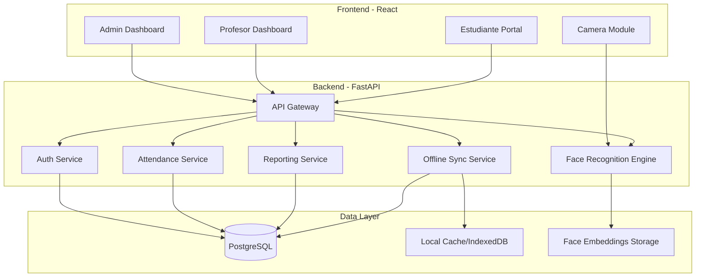
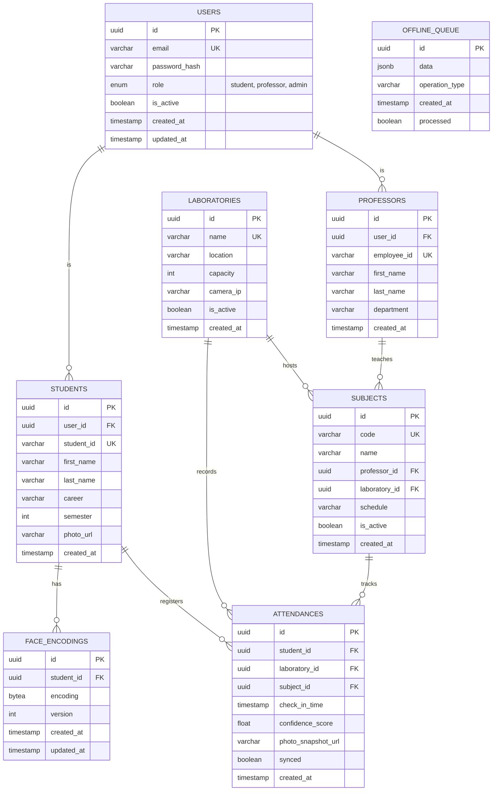
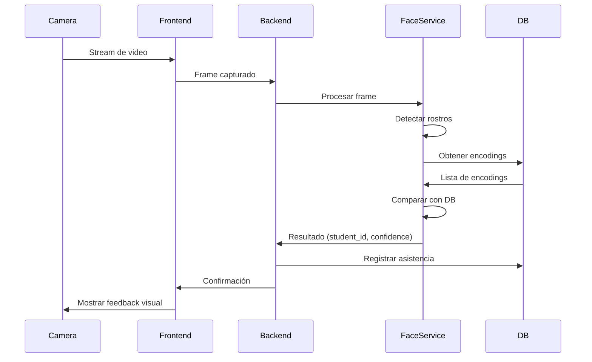
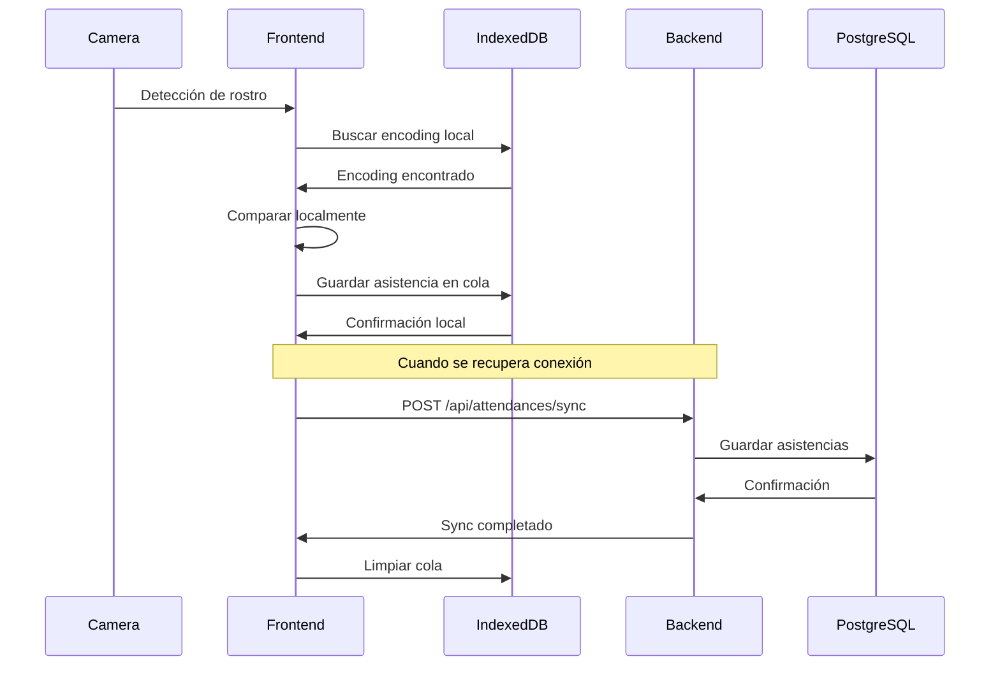

# Sistema de Control de Asistencias con Reconocimiento Facial

Sistema modular y escalable para control de asistencias en laboratorios universitarios usando reconocimiento facial con cámara fija y detección automática.

## Especificaciones del Sistema

**Alcance Inicial:**
- 100 estudiantes
- 2 laboratorios (arquitectura preparada para escalar)
- 3 roles: Estudiante, Profesor, Administrador
- Cámara fija por laboratorio con detección automática
- Registro de entrada únicamente
- Captura: horario, materia, profesor
- Funcionamiento offline

**Stack Tecnológico:**
- Frontend: React + Vite
- Backend: Python (FastAPI)
- Base de datos: PostgreSQL
- Reconocimiento Facial: face_recognition + OpenCV
- Self-hosted

---

## Arquitectura del Sistema



---

## Estructura del Proyecto

```
attendance-system/
├── frontend/                          # Aplicación React
│   ├── public/
│   ├── src/
│   │   ├── components/
│   │   │   ├── common/               # Componentes reutilizables
│   │   │   ├── admin/                # Componentes del admin
│   │   │   ├── professor/            # Componentes del profesor
│   │   │   ├── student/              # Componentes del estudiante
│   │   │   └── camera/               # Módulo de cámara
│   │   ├── services/
│   │   │   ├── api.service.js        # Cliente API
│   │   │   ├── auth.service.js       # Autenticación
│   │   │   ├── offline.service.js    # Manejo offline
│   │   │   └── camera.service.js     # Servicios de cámara
│   │   ├── pages/
│   │   │   ├── Login.jsx
│   │   │   ├── AdminDashboard.jsx
│   │   │   ├── ProfessorDashboard.jsx
│   │   │   ├── StudentPortal.jsx
│   │   │   └── LiveAttendance.jsx    # Vista de cámara en vivo
│   │   ├── hooks/
│   │   │   ├── useAuth.js
│   │   │   ├── useCamera.js
│   │   │   └── useOffline.js
│   │   ├── context/
│   │   │   ├── AuthContext.jsx
│   │   │   └── OfflineContext.jsx
│   │   ├── utils/
│   │   │   ├── constants.js
│   │   │   └── helpers.js
│   │   ├── App.jsx
│   │   └── main.jsx
│   ├── package.json
│   └── vite.config.js
│
├── backend/                           # API Python
│   ├── app/
│   │   ├── __init__.py
│   │   ├── main.py                   # Entry point FastAPI
│   │   ├── config/
│   │   │   ├── __init__.py
│   │   │   ├── settings.py           # Configuración del sistema
│   │   │   └── database.py           # Configuración PostgreSQL
│   │   ├── models/                   # Modelos SQLAlchemy
│   │   │   ├── __init__.py
│   │   │   ├── user.py
│   │   │   ├── student.py
│   │   │   ├── professor.py
│   │   │   ├── laboratory.py
│   │   │   ├── subject.py
│   │   │   ├── attendance.py
│   │   │   └── face_encoding.py
│   │   ├── schemas/                  # Pydantic schemas
│   │   │   ├── __init__.py
│   │   │   ├── user.py
│   │   │   ├── student.py
│   │   │   ├── attendance.py
│   │   │   └── report.py
│   │   ├── api/                      # Endpoints
│   │   │   ├── __init__.py
│   │   │   ├── auth.py
│   │   │   ├── students.py
│   │   │   ├── professors.py
│   │   │   ├── laboratories.py
│   │   │   ├── attendance.py
│   │   │   ├── reports.py
│   │   │   └── face_recognition.py
│   │   ├── services/                 # Lógica de negocio
│   │   │   ├── __init__.py
│   │   │   ├── auth_service.py
│   │   │   ├── face_service.py       # Motor de reconocimiento facial
│   │   │   ├── attendance_service.py
│   │   │   ├── report_service.py
│   │   │   └── offline_sync_service.py
│   │   ├── core/                     # Utilidades core
│   │   │   ├── __init__.py
│   │   │   ├── security.py           # JWT, hashing
│   │   │   ├── dependencies.py       # Dependencias FastAPI
│   │   │   └── exceptions.py
│   │   └── middleware/
│   │       ├── __init__.py
│   │       └── offline_handler.py
│   ├── alembic/                      # Migraciones de DB
│   │   └── versions/
│   ├── tests/
│   │   ├── unit/
│   │   └── integration/
│   ├── requirements.txt
│   ├── alembic.ini
│   └── README.md
│
├── database/
│   ├── init.sql                      # Script inicial de PostgreSQL
│   └── seed_data.sql                 # Datos de prueba
│
├── scripts/
│   ├── setup.sh                      # Script de instalación
│   └── backup.sh                     # Script de backup
│
├── docker/
│   ├── Dockerfile.backend
│   ├── Dockerfile.frontend
│   └── docker-compose.yml
│
├── docs/
│   ├── API.md                        # Documentación de API
│   ├── DEPLOYMENT.md                 # Guía de despliegue
│   └── USER_GUIDE.md                 # Manual de usuario
│
└── README.md
```

---

## Diseño de Base de Datos

### Esquema PostgreSQL



### Índices Importantes

```sql
-- Búsquedas frecuentes por estudiante y fecha
CREATE INDEX idx_attendance_student_date ON attendances(student_id, check_in_time);

-- Búsquedas por laboratorio y materia
CREATE INDEX idx_attendance_lab_subject ON attendances(laboratory_id, subject_id);

-- Búsqueda rápida de encodings activos
CREATE INDEX idx_face_encodings_student ON face_encodings(student_id, version);

-- Cola offline
CREATE INDEX idx_offline_queue_processed ON offline_queue(processed, created_at);
```

---

## API Endpoints

### Autenticación
| Método | Endpoint | Descripción | Roles |
|--------|----------|-------------|-------|
| POST | `/api/auth/login` | Login de usuario | Todos |
| POST | `/api/auth/logout` | Logout | Todos |
| GET | `/api/auth/me` | Info usuario actual | Todos |

### Estudiantes
| Método | Endpoint | Descripción | Roles |
|--------|----------|-------------|-------|
| GET | `/api/students` | Lista de estudiantes | Admin, Profesor |
| POST | `/api/students` | Crear estudiante | Admin |
| GET | `/api/students/{id}` | Detalle estudiante | Admin, Profesor, Owner |
| PUT | `/api/students/{id}` | Actualizar estudiante | Admin |
| DELETE | `/api/students/{id}` | Eliminar estudiante | Admin |
| POST | `/api/students/{id}/face` | Registrar foto facial | Admin |

### Reconocimiento Facial
| Método | Endpoint | Descripción | Roles |
|--------|----------|-------------|-------|
| POST | `/api/face/recognize` | Reconocer rostro | Sistema |
| POST | `/api/face/enroll` | Enrollar nuevo rostro | Admin |
| PUT | `/api/face/update/{student_id}` | Actualizar encoding | Admin |

### Asistencias
| Método | Endpoint | Descripción | Roles |
|--------|----------|-------------|-------|
| GET | `/api/attendances` | Lista asistencias (filtros) | Admin, Profesor |
| POST | `/api/attendances` | Registrar asistencia | Sistema |
| GET | `/api/attendances/student/{id}` | Historial estudiante | Admin, Profesor, Owner |
| POST | `/api/attendances/sync` | Sincronizar offline | Sistema |

### Reportes
| Método | Endpoint | Descripción | Roles |
|--------|----------|-------------|-------|
| GET | `/api/reports/laboratory/{id}` | Reporte por laboratorio | Admin, Profesor |
| GET | `/api/reports/subject/{id}` | Reporte por materia | Admin, Profesor |
| GET | `/api/reports/student/{id}` | Reporte por estudiante | Admin, Profesor, Owner |
| GET | `/api/reports/statistics` | Estadísticas generales | Admin |

### Laboratorios
| Método | Endpoint | Descripción | Roles |
|--------|----------|-------------|-------|
| GET | `/api/laboratories` | Lista laboratorios | Admin |
| POST | `/api/laboratories` | Crear laboratorio | Admin |
| PUT | `/api/laboratories/{id}` | Actualizar laboratorio | Admin |

### Materias
| Método | Endpoint | Descripción | Roles |
|--------|----------|-------------|-------|
| GET | `/api/subjects` | Lista materias | Admin, Profesor |
| POST | `/api/subjects` | Crear materia | Admin |
| PUT | `/api/subjects/{id}` | Actualizar materia | Admin, Profesor |

---

## Módulo de Reconocimiento Facial

### Tecnologías
- **face_recognition**: Librería Python basada en dlib para reconocimiento facial
- **OpenCV**: Procesamiento de video y detección de rostros
- **NumPy**: Manejo de arrays de encodings

### Flujo de Reconocimiento



### Proceso de Enrollment (Registro de Rostro)

1. **Captura**: Admin toma 3-5 fotos del estudiante en diferentes ángulos
2. **Procesamiento**: Sistema genera encodings faciales (128-dimensional vector)
3. **Validación**: Verifica calidad de las imágenes
4. **Almacenamiento**: Guarda encoding en PostgreSQL y foto en storage

### Proceso de Reconocimiento en Tiempo Real

1. **Detección**: OpenCV detecta rostros en el frame
2. **Extracción**: face_recognition genera encoding del rostro detectado
3. **Comparación**: Compara con encodings en base de datos (threshold: 0.6)
4. **Validación**: Si coincide y confidence > 60%, registra asistencia
5. **Registro**: Guarda asistencia con timestamp, laboratorio, materia

---

## Funcionalidad Offline

### Estrategia de Implementación

**En el Frontend (React):**
- **Service Worker**: Cache de assets estáticos
- **IndexedDB**: Almacenamiento local de datos críticos
- **Queue System**: Cola de operaciones pendientes

**En el Backend:**
- **Offline Sync Endpoint**: `/api/attendances/sync`
- **Conflict Resolution**: Timestamp-based (last-write-wins)

### Datos Almacenados Localmente

1. **Encodings faciales** de estudiantes activos (sincronizado cada 24h)
2. **Lista de materias** del día actual
3. **Info de laboratorio** local
4. **Cola de asistencias** no sincronizadas

### Flujo Offline



---

## Dashboards y Vistas

### 1. Admin Dashboard

**Funcionalidades:**
- Vista general de asistencias del día
- Gestión de estudiantes (CRUD)
- Gestión de profesores (CRUD)
- Gestión de laboratorios (CRUD)
- Gestión de materias (CRUD)
- Reportes y estadísticas generales
- Configuración del sistema

**Componentes Principales:**
- `StudentManagement.jsx`
- `ProfessorManagement.jsx`
- `LaboratoryManagement.jsx`
- `SubjectManagement.jsx`
- `SystemStats.jsx`
- `FaceEnrollment.jsx`

### 2. Professor Dashboard

**Funcionalidades:**
- Ver asistencias de sus materias
- Filtrar por materia, fecha, laboratorio
- Ver estadísticas de asistencia por estudiante
- Exportar reportes (CSV)
- Ver lista de estudiantes inscritos

**Componentes Principales:**
- `MySubjects.jsx`
- `AttendanceList.jsx`
- `StudentStats.jsx`
- `ReportExport.jsx`

### 3. Student Portal

**Funcionalidades:**
- Ver su historial de asistencias
- Ver materias inscritas
- Ver estadísticas personales
- Actualizar perfil (foto)

**Componentes Principales:**
- `MyAttendance.jsx`
- `MySubjects.jsx`
- `ProfileUpdate.jsx`

### 4. Live Attendance (Cámara en Vivo)

**Funcionalidades:**
- Stream de cámara en tiempo real
- Detección automática de rostros
- Registro automático de asistencia
- Feedback visual (nombre, confirmación)
- Selección de materia actual

**Componentes Principales:**
- `CameraStream.jsx`
- `FaceDetection.jsx`
- `AttendanceConfirmation.jsx`

---

## Stack Tecnológico Detallado

### Frontend

```json
{
  "dependencies": {
    "react": "^18.2.0",
    "react-dom": "^18.2.0",
    "react-router-dom": "^6.20.0",
    "@tanstack/react-query": "^5.0.0",
    "axios": "^1.6.0",
    "zustand": "^4.4.0",
    "react-webcam": "^7.2.0",
    "chart.js": "^4.4.0",
    "react-chartjs-2": "^5.2.0",
    "date-fns": "^2.30.0",
    "react-toastify": "^9.1.3",
    "dexie": "^3.2.4"
  },
  "devDependencies": {
    "@vitejs/plugin-react": "^4.2.0",
    "vite": "^5.0.0",
    "vite-plugin-pwa": "^0.17.0"
  }
}
```

### Backend

```txt
fastapi==0.109.0
uvicorn[standard]==0.27.0
sqlalchemy==2.0.25
alembic==1.13.1
psycopg2-binary==2.9.9
pydantic==2.5.3
python-jose[cryptography]==3.3.0
passlib[bcrypt]==1.7.4
python-multipart==0.0.6
face-recognition==1.3.0
opencv-python==4.9.0.80
numpy==1.26.3
pillow==10.2.0
python-dotenv==1.0.0
```

---

## Plan de Despliegue

### Opción 1: Servidor Local (Self-Hosted)

**Requisitos de Hardware:**
- CPU: 4 cores mínimo (8 recomendado para reconocimiento facial)
- RAM: 8GB mínimo (16GB recomendado)
- Almacenamiento: 100GB SSD
- GPU (opcional pero recomendado): NVIDIA para acelerar face_recognition

**Software:**
- Ubuntu Server 22.04 LTS
- PostgreSQL 15
- Python 3.11+
- Node.js 20+
- Nginx (reverse proxy)
- Docker & Docker Compose (opcional)

### Opción 2: Docker Compose

```yaml
version: '3.8'

services:
  db:
    image: postgres:15
    environment:
      POSTGRES_DB: attendance_db
      POSTGRES_USER: admin
      POSTGRES_PASSWORD: secure_password
    volumes:
      - postgres_data:/var/lib/postgresql/data
    ports:
      - "5432:5432"

  backend:
    build:
      context: ./backend
      dockerfile: ../docker/Dockerfile.backend
    environment:
      DATABASE_URL: postgresql://admin:secure_password@db:5432/attendance_db
    depends_on:
      - db
    ports:
      - "8000:8000"
    volumes:
      - ./backend:/app
      - face_data:/app/face_storage

  frontend:
    build:
      context: ./frontend
      dockerfile: ../docker/Dockerfile.frontend
    ports:
      - "3000:3000"
    depends_on:
      - backend

  nginx:
    image: nginx:alpine
    ports:
      - "80:80"
      - "443:443"
    volumes:
      - ./nginx.conf:/etc/nginx/nginx.conf
    depends_on:
      - frontend
      - backend

volumes:
  postgres_data:
  face_data:
```

---

## Fases de Desarrollo

### Fase 1: Fundamentos (Semanas 1-2)
- [x] Diseño de arquitectura
- [ ] Setup de proyecto (frontend + backend)
- [ ] Configuración de base de datos
- [ ] Sistema de autenticación básico
- [ ] Modelos de datos

### Fase 2: Reconocimiento Facial (Semanas 3-4)
- [ ] Integración de face_recognition
- [ ] Módulo de enrollment
- [ ] API de reconocimiento
- [ ] Testing del motor facial

### Fase 3: Frontend Core (Semanas 5-6)
- [ ] Componentes base
- [ ] Admin dashboard
- [ ] Professor dashboard
- [ ] Student portal
- [ ] Integración con API

### Fase 4: Funcionalidad de Cámara (Semana 7)
- [ ] Módulo de cámara en vivo
- [ ] Detección automática
- [ ] Registro de asistencia en tiempo real
- [ ] Feedback visual

### Fase 5: Reportes y Analytics (Semana 8)
- [ ] Sistema de reportes
- [ ] Dashboards con estadísticas
- [ ] Exportación de datos

### Fase 6: Offline & Optimización (Semana 9)
- [ ] Service Worker
- [ ] IndexedDB setup
- [ ] Sistema de sincronización
- [ ] Manejo de conflictos

### Fase 7: Testing & Deploy (Semana 10)
- [ ] Testing completo
- [ ] Documentación
- [ ] Deployment
- [ ] Capacitación

---

## Próximos Pasos

> [!IMPORTANT]
> Esta es la **arquitectura propuesta** para tu sistema de asistencias. Revisa cuidadosamente antes de proceder.

### ¿Qué sigue?

1. **Revisión de esta propuesta**: ¿Hay algo que quieras ajustar o agregar?
2. **Iniciar Fase 1**: Crear la estructura base del proyecto
3. **Setup del entorno**: Instalar dependencias y configurar herramientas

### Decisiones Pendientes

- [ ] ¿Prefieres usar Docker o instalación directa?
- [ ] ¿Tienes ya el servidor donde se desplegará?
- [ ] ¿Necesitas que genere documentación adicional de algún módulo específico?
