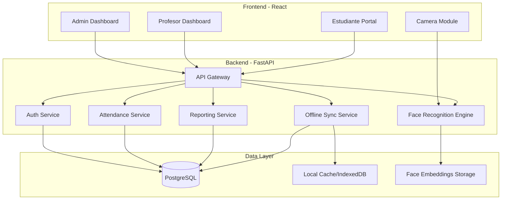
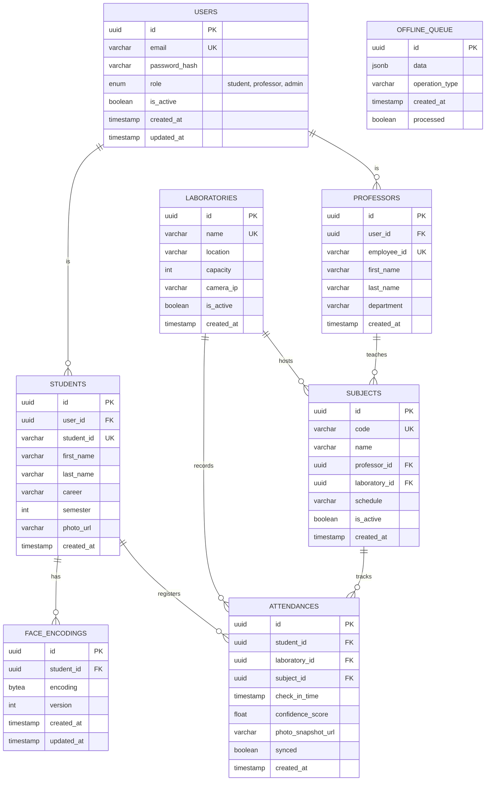
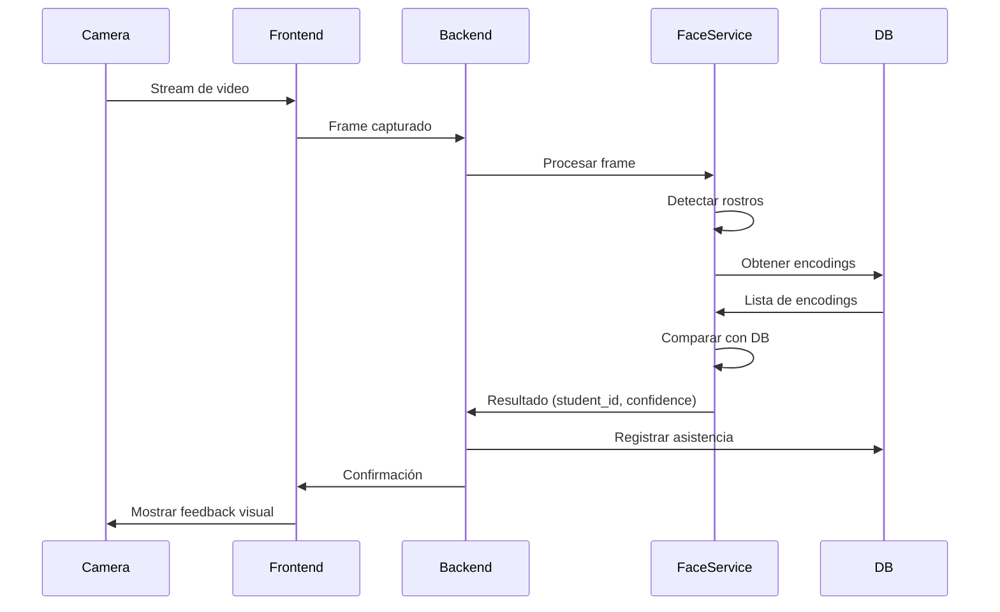
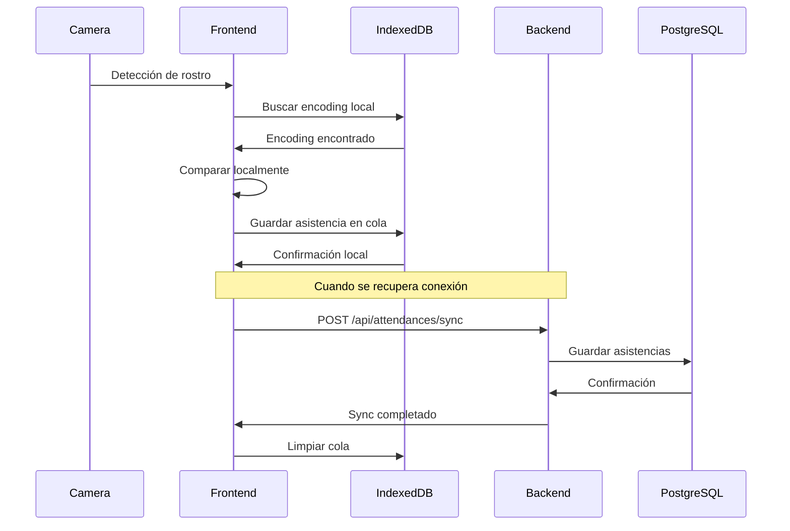

# Sistema de Control de Asistencias con Reconocimiento Facial

# Sprint Final: Refactorización y Modo Offline Real

Este sprint abordará las deudas técnicas más importantes y completará la funcionalidad offline para tener el sistema listo para producción.

## User Review Required
> [!IMPORTANT]
> Revisa este plan de acción final. Modificaremos archivos clave del backend y ajustaremos la configuración del frontend para habilitar la PWA.

## Proposed Changes

### Backend Refactoring (Capa de Servicios)
Vamos a extraer toda la lógica de negocio que está mezclada dentro de los endpoints de la API hacia la capa de servicios, respetando la arquitectura original.

#### [NEW] `backend/app/services/report_service.py`
- Moveremos la lógica de cálculo de tendencias, conteos diarios y medias móviles (promedios de confianza).
- Crearemos funciones puras que reciban la sesión de DB y los parámetros.

#### [NEW] `backend/app/services/attendance_service.py`
- Moveremos la lógica de registro manual, carga de encodings (helper `_load_encodings`), validación antiduplicados y la lógica de sincronización offline masiva.

#### [NEW] `backend/app/services/offline_sync_service.py`
- Encapsulará la lógica de conciliación (conflict resolution) para cuando el frontend envíe múltiples asistencias offline acumuladas.

#### [MODIFY] `backend/app/api/reports.py`
- Se limpiará drásticamente. Ahora solo recibirá el request (HTTP), validará permisos, llamará a `report_service.py` y devolverá la respuesta.

#### [MODIFY] `backend/app/api/attendance.py`
- Se simplificará delegando la lógica pesada a `attendance_service.py`. Mantendrá únicamente la inyección de dependencias y la generación del stream MJPEG (que ya depende de `face_service.py`).

---

### Frontend PWA (Modo Offline Real)
Para que el sistema sea inmune a caídas de red, IndexedDB no es suficiente. Necesitamos cachear los assets estáticos del frontend.

#### [MODIFY] `frontend/package.json`
- Agregar la dependencia de desarrollo `vite-plugin-pwa`.

#### [MODIFY] `frontend/vite.config.js`
- Configurar el plugin de PWA con estrategias de caché `NetworkFirst` para la API y `CacheFirst` para los assets estáticos. Configurar el *manifest* de la aplicación.

#### [MODIFY] `frontend/src/main.jsx`
- Registrar el *Service Worker* generado por Vite para activar el soporte offline.

## Verification Plan

### Automated Tests (Siguiente Paso)
- Una vez completada la refactorización, el código será testable. En un paso posterior crearemos las pruebas automatizadas (Test Unitarios).

### Manual Verification
- **Backend**: Realizaremos llamadas HTTP a todos los endpoints de reportes y asistencias para verificar que el comportamiento sea idéntico (pruebas de regresión).
- **Frontend**: Apagaremos el contenedor del servidor o simularemos modo *Offline* en Chrome DevTools y recargaremos la página de asistencias. La página deberá cargar instantáneamente mostrando los datos cacheados.

---

Sistema modular y escalable para control de asistencias en laboratorios universitarios usando reconocimiento facial con cámara fija y detección automática.

## Especificaciones del Sistema

**Alcance Inicial:**
- 100 estudiantes
- 2 laboratorios (arquitectura preparada para escalar)
- 3 roles: Estudiante, Profesor, Administrador
- Cámara fija por laboratorio con detección automática
- Registro de entrada únicamente
- Captura: horario, materia, profesor
- Funcionamiento offline

**Stack Tecnológico:**
- Frontend: React + Vite
- Backend: Python (FastAPI)
- Base de datos: PostgreSQL
- Reconocimiento Facial: face_recognition + OpenCV
- Self-hosted

---

## Arquitectura del Sistema


```mermaid
graph TB
    subgraph "Frontend - React"
        A[Admin Dashboard]
        B[Profesor Dashboard]
        C[Estudiante Portal]
        D[Camera Module]
    end
    
    subgraph "Backend - FastAPI"
        E[API Gateway]
        F[Auth Service]
        G[Face Recognition Engine]
        H[Attendance Service]
        I[Reporting Service]
        J[Offline Sync Service]
    end
    
    subgraph "Data Layer"
        K[(PostgreSQL)]
        L[Local Cache/IndexedDB]
        M[Face Embeddings Storage]
    end
    
    D --> G
    A --> E
    B --> E
    C --> E
    E --> F
    E --> G
    E --> H
    E --> I
    E --> J
    F --> K
    G --> M
    H --> K
    I --> K
    J --> L
    J --> K
```

---

## Estructura del Proyecto

```
attendance-system/
├── frontend/                          # Aplicación React
│   ├── public/
│   ├── src/
│   │   ├── components/
│   │   │   ├── common/               # Componentes reutilizables
│   │   │   ├── admin/                # Componentes del admin
│   │   │   ├── professor/            # Componentes del profesor
│   │   │   ├── student/              # Componentes del estudiante
│   │   │   └── camera/               # Módulo de cámara
│   │   ├── services/
│   │   │   ├── api.service.js        # Cliente API
│   │   │   ├── auth.service.js       # Autenticación
│   │   │   ├── offline.service.js    # Manejo offline
│   │   │   └── camera.service.js     # Servicios de cámara
│   │   ├── pages/
│   │   │   ├── Login.jsx
│   │   │   ├── AdminDashboard.jsx
│   │   │   ├── ProfessorDashboard.jsx
│   │   │   ├── StudentPortal.jsx
│   │   │   └── LiveAttendance.jsx    # Vista de cámara en vivo
│   │   ├── hooks/
│   │   │   ├── useAuth.js
│   │   │   ├── useCamera.js
│   │   │   └── useOffline.js
│   │   ├── context/
│   │   │   ├── AuthContext.jsx
│   │   │   └── OfflineContext.jsx
│   │   ├── utils/
│   │   │   ├── constants.js
│   │   │   └── helpers.js
│   │   ├── App.jsx
│   │   └── main.jsx
│   ├── package.json
│   └── vite.config.js
│
├── backend/                           # API Python
│   ├── app/
│   │   ├── __init__.py
│   │   ├── main.py                   # Entry point FastAPI
│   │   ├── config/
│   │   │   ├── __init__.py
│   │   │   ├── settings.py           # Configuración del sistema
│   │   │   └── database.py           # Configuración PostgreSQL
│   │   ├── models/                   # Modelos SQLAlchemy
│   │   │   ├── __init__.py
│   │   │   ├── user.py
│   │   │   ├── student.py
│   │   │   ├── professor.py
│   │   │   ├── laboratory.py
│   │   │   ├── subject.py
│   │   │   ├── attendance.py
│   │   │   └── face_encoding.py
│   │   ├── schemas/                  # Pydantic schemas
│   │   │   ├── __init__.py
│   │   │   ├── user.py
│   │   │   ├── student.py
│   │   │   ├── attendance.py
│   │   │   └── report.py
│   │   ├── api/                      # Endpoints
│   │   │   ├── __init__.py
│   │   │   ├── auth.py
│   │   │   ├── students.py
│   │   │   ├── professors.py
│   │   │   ├── laboratories.py
│   │   │   ├── attendance.py
│   │   │   ├── reports.py
│   │   │   └── face_recognition.py
│   │   ├── services/                 # Lógica de negocio
│   │   │   ├── __init__.py
│   │   │   ├── auth_service.py
│   │   │   ├── face_service.py       # Motor de reconocimiento facial
│   │   │   ├── attendance_service.py
│   │   │   ├── report_service.py
│   │   │   └── offline_sync_service.py
│   │   ├── core/                     # Utilidades core
│   │   │   ├── __init__.py
│   │   │   ├── security.py           # JWT, hashing
│   │   │   ├── dependencies.py       # Dependencias FastAPI
│   │   │   └── exceptions.py
│   │   └── middleware/
│   │       ├── __init__.py
│   │       └── offline_handler.py
│   ├── alembic/                      # Migraciones de DB
│   │   └── versions/
│   ├── tests/
│   │   ├── unit/
│   │   └── integration/
│   ├── requirements.txt
│   ├── alembic.ini
│   └── README.md
│
├── database/
│   ├── init.sql                      # Script inicial de PostgreSQL
│   └── seed_data.sql                 # Datos de prueba
│
├── scripts/
│   ├── setup.sh                      # Script de instalación
│   └── backup.sh                     # Script de backup
│
├── docker/
│   ├── Dockerfile.backend
│   ├── Dockerfile.frontend
│   └── docker-compose.yml
│
├── docs/
│   ├── API.md                        # Documentación de API
│   ├── DEPLOYMENT.md                 # Guía de despliegue
│   └── USER_GUIDE.md                 # Manual de usuario
│
└── README.md
```

---

## Diseño de Base de Datos

### Esquema PostgreSQL


```mermaid
erDiagram
    USERS ||--o{ STUDENTS : is
    USERS ||--o{ PROFESSORS : is
    STUDENTS ||--o{ FACE_ENCODINGS : has
    STUDENTS ||--o{ ATTENDANCES : registers
    LABORATORIES ||--o{ ATTENDANCES : records
    SUBJECTS ||--o{ ATTENDANCES : tracks
    PROFESSORS ||--o{ SUBJECTS : teaches
    LABORATORIES ||--o{ SUBJECTS : hosts

    USERS {
        uuid id PK
        varchar email UK
        varchar password_hash
        enum role "student, professor, admin"
        boolean is_active
        timestamp created_at
        timestamp updated_at
    }

    STUDENTS {
        uuid id PK
        uuid user_id FK
        varchar student_id UK
        varchar first_name
        varchar last_name
        varchar career
        int semester
        varchar photo_url
        timestamp created_at
    }

    PROFESSORS {
        uuid id PK
        uuid user_id FK
        varchar employee_id UK
        varchar first_name
        varchar last_name
        varchar department
        timestamp created_at
    }

    LABORATORIES {
        uuid id PK
        varchar name UK
        varchar location
        int capacity
        varchar camera_ip
        boolean is_active
        timestamp created_at
    }

    SUBJECTS {
        uuid id PK
        varchar code UK
        varchar name
        uuid professor_id FK
        uuid laboratory_id FK
        varchar schedule
        boolean is_active
        timestamp created_at
    }

    FACE_ENCODINGS {
        uuid id PK
        uuid student_id FK
        bytea encoding
        int version
        timestamp created_at
        timestamp updated_at
    }

    ATTENDANCES {
        uuid id PK
        uuid student_id FK
        uuid laboratory_id FK
        uuid subject_id FK
        timestamp check_in_time
        float confidence_score
        varchar photo_snapshot_url
        boolean synced
        timestamp created_at
    }

    OFFLINE_QUEUE {
        uuid id PK
        jsonb data
        varchar operation_type
        timestamp created_at
        boolean processed
    }
```

### Índices Importantes

```sql
-- Búsquedas frecuentes por estudiante y fecha
CREATE INDEX idx_attendance_student_date ON attendances(student_id, check_in_time);

-- Búsquedas por laboratorio y materia
CREATE INDEX idx_attendance_lab_subject ON attendances(laboratory_id, subject_id);

-- Búsqueda rápida de encodings activos
CREATE INDEX idx_face_encodings_student ON face_encodings(student_id, version);

-- Cola offline
CREATE INDEX idx_offline_queue_processed ON offline_queue(processed, created_at);
```

---

## API Endpoints

### Autenticación
| Método | Endpoint | Descripción | Roles |
|--------|----------|-------------|-------|
| POST | `/api/auth/login` | Login de usuario | Todos |
| POST | `/api/auth/logout` | Logout | Todos |
| GET | `/api/auth/me` | Info usuario actual | Todos |

### Estudiantes
| Método | Endpoint | Descripción | Roles |
|--------|----------|-------------|-------|
| GET | `/api/students` | Lista de estudiantes | Admin, Profesor |
| POST | `/api/students` | Crear estudiante | Admin |
| GET | `/api/students/{id}` | Detalle estudiante | Admin, Profesor, Owner |
| PUT | `/api/students/{id}` | Actualizar estudiante | Admin |
| DELETE | `/api/students/{id}` | Eliminar estudiante | Admin |
| POST | `/api/students/{id}/face` | Registrar foto facial | Admin |

### Reconocimiento Facial
| Método | Endpoint | Descripción | Roles |
|--------|----------|-------------|-------|
| POST | `/api/face/recognize` | Reconocer rostro | Sistema |
| POST | `/api/face/enroll` | Enrollar nuevo rostro | Admin |
| PUT | `/api/face/update/{student_id}` | Actualizar encoding | Admin |

### Asistencias
| Método | Endpoint | Descripción | Roles |
|--------|----------|-------------|-------|
| GET | `/api/attendances` | Lista asistencias (filtros) | Admin, Profesor |
| POST | `/api/attendances` | Registrar asistencia | Sistema |
| GET | `/api/attendances/student/{id}` | Historial estudiante | Admin, Profesor, Owner |
| POST | `/api/attendances/sync` | Sincronizar offline | Sistema |

### Reportes
| Método | Endpoint | Descripción | Roles |
|--------|----------|-------------|-------|
| GET | `/api/reports/laboratory/{id}` | Reporte por laboratorio | Admin, Profesor |
| GET | `/api/reports/subject/{id}` | Reporte por materia | Admin, Profesor |
| GET | `/api/reports/student/{id}` | Reporte por estudiante | Admin, Profesor, Owner |
| GET | `/api/reports/statistics` | Estadísticas generales | Admin |

### Laboratorios
| Método | Endpoint | Descripción | Roles |
|--------|----------|-------------|-------|
| GET | `/api/laboratories` | Lista laboratorios | Admin |
| POST | `/api/laboratories` | Crear laboratorio | Admin |
| PUT | `/api/laboratories/{id}` | Actualizar laboratorio | Admin |

### Materias
| Método | Endpoint | Descripción | Roles |
|--------|----------|-------------|-------|
| GET | `/api/subjects` | Lista materias | Admin, Profesor |
| POST | `/api/subjects` | Crear materia | Admin |
| PUT | `/api/subjects/{id}` | Actualizar materia | Admin, Profesor |

---

## Módulo de Reconocimiento Facial

### Tecnologías
- **face_recognition**: Librería Python basada en dlib para reconocimiento facial
- **OpenCV**: Procesamiento de video y detección de rostros
- **NumPy**: Manejo de arrays de encodings

### Flujo de Reconocimiento


```mermaid
sequenceDiagram
    participant Camera
    participant Frontend
    participant Backend
    participant FaceService
    participant DB

    Camera->>Frontend: Stream de video
    Frontend->>Backend: Frame capturado
    Backend->>FaceService: Procesar frame
    FaceService->>FaceService: Detectar rostros
    FaceService->>DB: Obtener encodings
    DB->>FaceService: Lista de encodings
    FaceService->>FaceService: Comparar con DB
    FaceService->>Backend: Resultado (student_id, confidence)
    Backend->>DB: Registrar asistencia
    Backend->>Frontend: Confirmación
    Frontend->>Camera: Mostrar feedback visual
```

### Proceso de Enrollment (Registro de Rostro)

1. **Captura**: Admin toma 3-5 fotos del estudiante en diferentes ángulos
2. **Procesamiento**: Sistema genera encodings faciales (128-dimensional vector)
3. **Validación**: Verifica calidad de las imágenes
4. **Almacenamiento**: Guarda encoding en PostgreSQL y foto en storage

### Proceso de Reconocimiento en Tiempo Real

1. **Detección**: OpenCV detecta rostros en el frame
2. **Extracción**: face_recognition genera encoding del rostro detectado
3. **Comparación**: Compara con encodings en base de datos (threshold: 0.6)
4. **Validación**: Si coincide y confidence > 60%, registra asistencia
5. **Registro**: Guarda asistencia con timestamp, laboratorio, materia

---

## Funcionalidad Offline

### Estrategia de Implementación

**En el Frontend (React):**
- **Service Worker**: Cache de assets estáticos
- **IndexedDB**: Almacenamiento local de datos críticos
- **Queue System**: Cola de operaciones pendientes

**En el Backend:**
- **Offline Sync Endpoint**: `/api/attendances/sync`
- **Conflict Resolution**: Timestamp-based (last-write-wins)

### Datos Almacenados Localmente

1. **Encodings faciales** de estudiantes activos (sincronizado cada 24h)
2. **Lista de materias** del día actual
3. **Info de laboratorio** local
4. **Cola de asistencias** no sincronizadas

### Flujo Offline


```mermaid
sequenceDiagram
    participant Camera
    participant Frontend
    participant IndexedDB
    participant Backend
    participant PostgreSQL

    Camera->>Frontend: Detección de rostro
    Frontend->>IndexedDB: Buscar encoding local
    IndexedDB->>Frontend: Encoding encontrado
    Frontend->>Frontend: Comparar localmente
    Frontend->>IndexedDB: Guardar asistencia en cola
    IndexedDB->>Frontend: Confirmación local
    
    Note over Frontend,Backend: Cuando se recupera conexión
    
    Frontend->>Backend: POST /api/attendances/sync
    Backend->>PostgreSQL: Guardar asistencias
    PostgreSQL->>Backend: Confirmación
    Backend->>Frontend: Sync completado
    Frontend->>IndexedDB: Limpiar cola
```

---

## Dashboards y Vistas

### 1. Admin Dashboard

**Funcionalidades:**
- Vista general de asistencias del día
- Gestión de estudiantes (CRUD)
- Gestión de profesores (CRUD)
- Gestión de laboratorios (CRUD)
- Gestión de materias (CRUD)
- Reportes y estadísticas generales
- Configuración del sistema

**Componentes Principales:**
- `StudentManagement.jsx`
- `ProfessorManagement.jsx`
- `LaboratoryManagement.jsx`
- `SubjectManagement.jsx`
- `SystemStats.jsx`
- `FaceEnrollment.jsx`

### 2. Professor Dashboard

**Funcionalidades:**
- Ver asistencias de sus materias
- Filtrar por materia, fecha, laboratorio
- Ver estadísticas de asistencia por estudiante
- Exportar reportes (CSV)
- Ver lista de estudiantes inscritos

**Componentes Principales:**
- `MySubjects.jsx`
- `AttendanceList.jsx`
- `StudentStats.jsx`
- `ReportExport.jsx`

### 3. Student Portal

**Funcionalidades:**
- Ver su historial de asistencias
- Ver materias inscritas
- Ver estadísticas personales
- Actualizar perfil (foto)

**Componentes Principales:**
- `MyAttendance.jsx`
- `MySubjects.jsx`
- `ProfileUpdate.jsx`

### 4. Live Attendance (Cámara en Vivo)

**Funcionalidades:**
- Stream de cámara en tiempo real
- Detección automática de rostros
- Registro automático de asistencia
- Feedback visual (nombre, confirmación)
- Selección de materia actual

**Componentes Principales:**
- `CameraStream.jsx`
- `FaceDetection.jsx`
- `AttendanceConfirmation.jsx`

---

## Stack Tecnológico Detallado

### Frontend

```json
{
  "dependencies": {
    "react": "^18.2.0",
    "react-dom": "^18.2.0",
    "react-router-dom": "^6.20.0",
    "@tanstack/react-query": "^5.0.0",
    "axios": "^1.6.0",
    "zustand": "^4.4.0",
    "react-webcam": "^7.2.0",
    "chart.js": "^4.4.0",
    "react-chartjs-2": "^5.2.0",
    "date-fns": "^2.30.0",
    "react-toastify": "^9.1.3",
    "dexie": "^3.2.4"
  },
  "devDependencies": {
    "@vitejs/plugin-react": "^4.2.0",
    "vite": "^5.0.0",
    "vite-plugin-pwa": "^0.17.0"
  }
}
```

### Backend

```txt
fastapi==0.109.0
uvicorn[standard]==0.27.0
sqlalchemy==2.0.25
alembic==1.13.1
psycopg2-binary==2.9.9
pydantic==2.5.3
python-jose[cryptography]==3.3.0
passlib[bcrypt]==1.7.4
python-multipart==0.0.6
face-recognition==1.3.0
opencv-python==4.9.0.80
numpy==1.26.3
pillow==10.2.0
python-dotenv==1.0.0
```

---

## Plan de Despliegue

### Opción 1: Servidor Local (Self-Hosted)

**Requisitos de Hardware:**
- CPU: 4 cores mínimo (8 recomendado para reconocimiento facial)
- RAM: 8GB mínimo (16GB recomendado)
- Almacenamiento: 100GB SSD
- GPU (opcional pero recomendado): NVIDIA para acelerar face_recognition

**Software:**
- Ubuntu Server 22.04 LTS
- PostgreSQL 15
- Python 3.11+
- Node.js 20+
- Nginx (reverse proxy)
- Docker & Docker Compose (opcional)

### Opción 2: Docker Compose

```yaml
version: '3.8'

services:
  db:
    image: postgres:15
    environment:
      POSTGRES_DB: attendance_db
      POSTGRES_USER: admin
      POSTGRES_PASSWORD: secure_password
    volumes:
      - postgres_data:/var/lib/postgresql/data
    ports:
      - "5432:5432"

  backend:
    build:
      context: ./backend
      dockerfile: ../docker/Dockerfile.backend
    environment:
      DATABASE_URL: postgresql://admin:secure_password@db:5432/attendance_db
    depends_on:
      - db
    ports:
      - "8000:8000"
    volumes:
      - ./backend:/app
      - face_data:/app/face_storage

  frontend:
    build:
      context: ./frontend
      dockerfile: ../docker/Dockerfile.frontend
    ports:
      - "3000:3000"
    depends_on:
      - backend

  nginx:
    image: nginx:alpine
    ports:
      - "80:80"
      - "443:443"
    volumes:
      - ./nginx.conf:/etc/nginx/nginx.conf
    depends_on:
      - frontend
      - backend

volumes:
  postgres_data:
  face_data:
```

---

## Fases de Desarrollo

### Fase 1: Fundamentos (Semanas 1-2)
- [x] Diseño de arquitectura
- [ ] Setup de proyecto (frontend + backend)
- [ ] Configuración de base de datos
- [ ] Sistema de autenticación básico
- [ ] Modelos de datos

### Fase 2: Reconocimiento Facial (Semanas 3-4)
- [ ] Integración de face_recognition
- [ ] Módulo de enrollment
- [ ] API de reconocimiento
- [ ] Testing del motor facial

### Fase 3: Frontend Core (Semanas 5-6)
- [ ] Componentes base
- [ ] Admin dashboard
- [ ] Professor dashboard
- [ ] Student portal
- [ ] Integración con API

### Fase 4: Funcionalidad de Cámara (Semana 7)
- [ ] Módulo de cámara en vivo
- [ ] Detección automática
- [ ] Registro de asistencia en tiempo real
- [ ] Feedback visual

### Fase 5: Reportes y Analytics (Semana 8)
- [ ] Sistema de reportes
- [ ] Dashboards con estadísticas
- [ ] Exportación de datos

### Fase 6: Offline & Optimización (Semana 9)
- [ ] Service Worker
- [ ] IndexedDB setup
- [ ] Sistema de sincronización
- [ ] Manejo de conflictos

### Fase 7: Testing & Deploy (Semana 10)
- [ ] Testing completo
- [ ] Documentación
- [ ] Deployment
- [ ] Capacitación

---

## Próximos Pasos

> [!IMPORTANT]
> Esta es la **arquitectura propuesta** para tu sistema de asistencias. Revisa cuidadosamente antes de proceder.

### ¿Qué sigue?

1. **Revisión de esta propuesta**: ¿Hay algo que quieras ajustar o agregar?
2. **Iniciar Fase 1**: Crear la estructura base del proyecto
3. **Setup del entorno**: Instalar dependencias y configurar herramientas

### Decisiones Pendientes

- [x] ¿Prefieres usar Docker o instalación directa? -> **Docker seleccionado**
- [ ] ¿Tienes ya el servidor donde se desplegará?
- [ ] ¿Necesitas que genere documentación adicional de algún módulo específico?

---

## Plan de Implementación de Docker (En Progreso)

Dado que ya tienes instalado Docker, configuraremos la arquitectura basada en contenedores. Esto eliminará todos los problemas de instalación de dependencias en Windows (especialmente para `dlib` y `face_recognition`) y asegurará un entorno consistente.

### Propuesta de Archivos a Crear/Modificar

#### 1. [NEW] `docker/Dockerfile.backend`
Imagen basada en `python:3.10-slim`.
- Instalará dependencias del sistema necesarias para compilar `dlib` y ejecutar OpenCV (`build-essential`, `cmake`, `libgl1-mesa-glx`, etc.).
- Instalará las dependencias de Python desde `backend/requirements.txt`.
- Expondrá el puerto 8000.

#### 2. [NEW] `docker/Dockerfile.frontend`
Imagen basada en `node:20-alpine`.
- Copiará el código del frontend y sus dependencias.
- Se configurará para ejecutarse en modo desarrollo (`npm run dev`) con hot-reloading para que puedas editar código y ver cambios en tiempo real.
- Expondrá el puerto 5173 (puerto por defecto de Vite).

#### 3. [NEW] `docker-compose.yml`
Se creará en la raíz del proyecto para orquestar los tres servicios:
- **db**: Base de datos PostgreSQL persistente (usando volúmenes de Docker).
- **backend**: La API de FastAPI, conectada a la base de datos.
- **frontend**: La aplicación React/Vite.

#### 4. Archivos de configuración de entorno
- Actualizar o crear `.env` para que el backend se conecte al host `db` (nombre del contenedor de PostgreSQL) en lugar de `localhost`.
- Añadir `.dockerignore` tanto para backend como para frontend para evitar copiar archivos innecesarios (`node_modules`, `__pycache__`, etc.) y acelerar las construcciones.

### User Review Required
> [!IMPORTANT]
> Revisa este plan de configuración de Docker. Al compilar el contenedor del backend por primera vez, tomará algo de tiempo (aproximadamente 5-15 minutos) porque necesita compilar la librería `dlib` desde cero en el contenedor de Linux.
> 
> Si estás de acuerdo con este enfoque, procederé a crear los Dockerfiles y el `docker-compose.yml` de inmediato.
